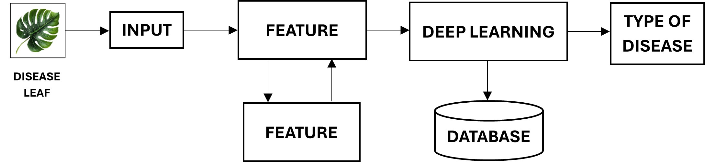

# Leaf Disease Detection

A comprehensive deep learning-based project designed to detect and classify diseases in leaves using advanced image processing and neural network models. This repository contains the source code, datasets, and workflow documentation required for leaf disease detection.

## Features
- **Disease Detection**: Identify and classify leaf diseases using deep learning.
- **Image Preprocessing**: Automated cleaning and resizing of input images.
- **Database Integration**: Seamless interaction with training and testing datasets.
- **Interactive Workflow**: Clear visual diagrams and user-friendly interfaces.

## Workflow Diagram


The diagram represents the leaf disease detection process, starting from the input image, feature extraction, and database integration to classification using deep learning models.

## Project Structure
```
Leaf-Disease-Detection/
├── figures/
│   └─Streamlit
│   └─Streamlit2
│   └─Streamlit3
├── models/
│   └── plant_disease.h5
├── notebooks/
│   └── Model_Training.ipynb
├── src/
│   ├── main.py
├── static/
│   ├── images
├── test_images/
│   ├── #contain images for testing
├── README.md
├── requirements.txt
```

## Getting Started

### Prerequisites
Make sure you have the following installed:
- Python 3.9 or later
- Pip
- Virtual Environment (optional but recommended)

### Installation
1. Clone the repository:
   ```bash
   git clone https://github.com/username/Leaf-Disease-Detection.git
   cd Leaf-Disease-Detection
   ```

2. Install dependencies:
   ```bash
   pip install -r requirements.txt
   ```


### Usage
Run the main program:
```bash
streamlit run src/main.py
```

Explore the visualizations and results in the `notebooks/` folder:
```bash
jupyter notebook notebooks/Model_Training.ipynb
```

## Requirements
The project depends on the following libraries:
- Python 3.9 or later
- TensorFlow 2.x
- Pandas
- NumPy
- OpenCV
- Matplotlib
- Streamlit

All dependencies are listed in the `requirements.txt` file.

## Results
The project outputs include:
- Predicted disease types with probabilities.
- Preprocessed leaf images.
- Metrics such as accuracy, precision, and recall.


## Acknowledgments
- Special thanks to open-source libraries and contributors.
- Inspired by various deep learning projects in agriculture.
